# 🏎 F1 Race Engineer Simulator

A real-time Formula 1 race strategy simulation built with Python and Streamlit. Play as a race engineer managing your driver through a full Grand Prix — tire strategy, push levels, pit windows, and live telemetry.

## Screenshots

### Setup & Driver Selection
| Random Mode | Manual Mode (Driver Card) |
|:-----------:|:-------------------------:|
| 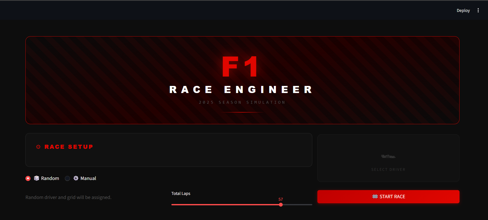 | 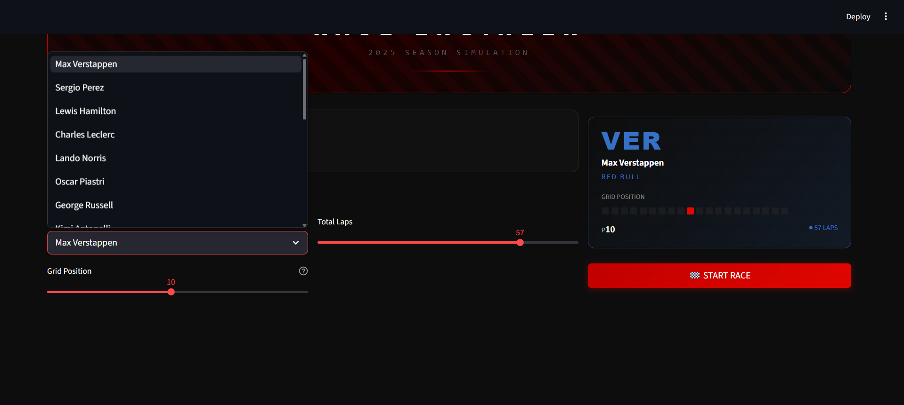 |

### Strategy Selection
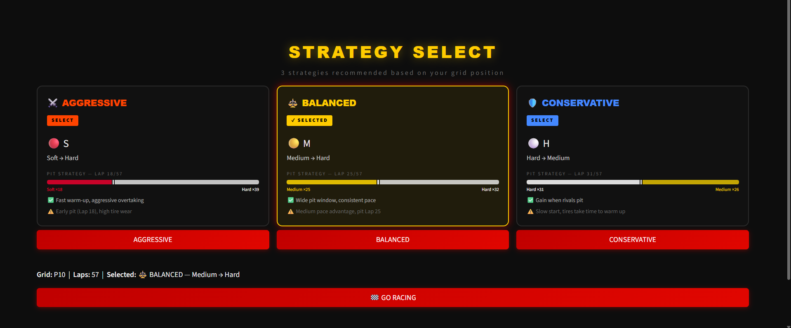

### Lights Out
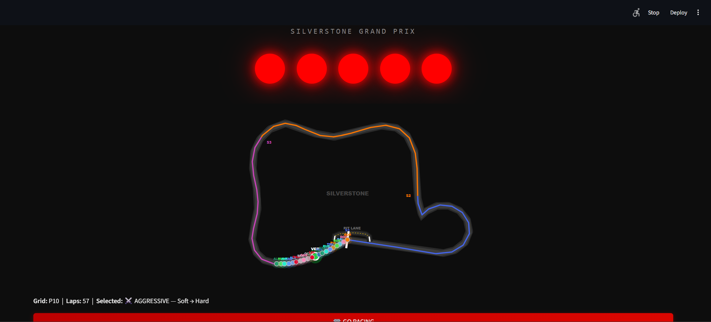

### Live Race
| Track Map + Timing Tower | Race Controls & Tactics |
|:------------------------:|:------------------------:|
| 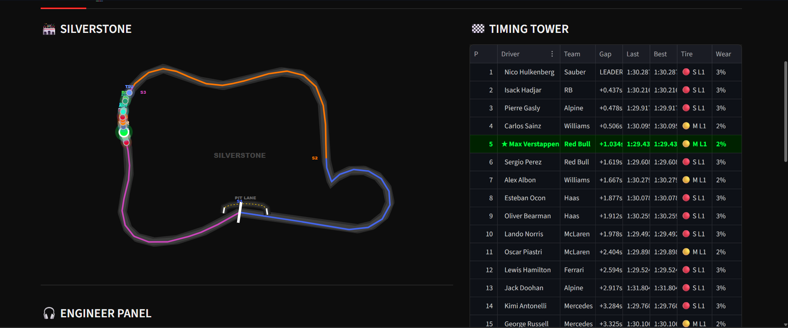 | 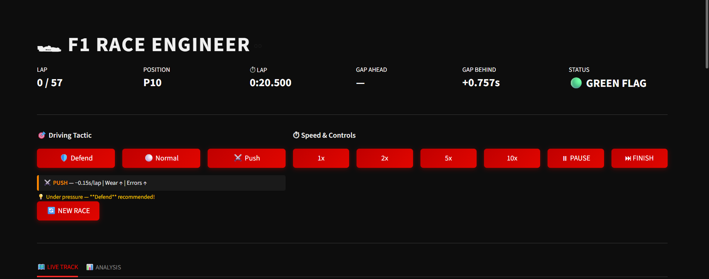 |

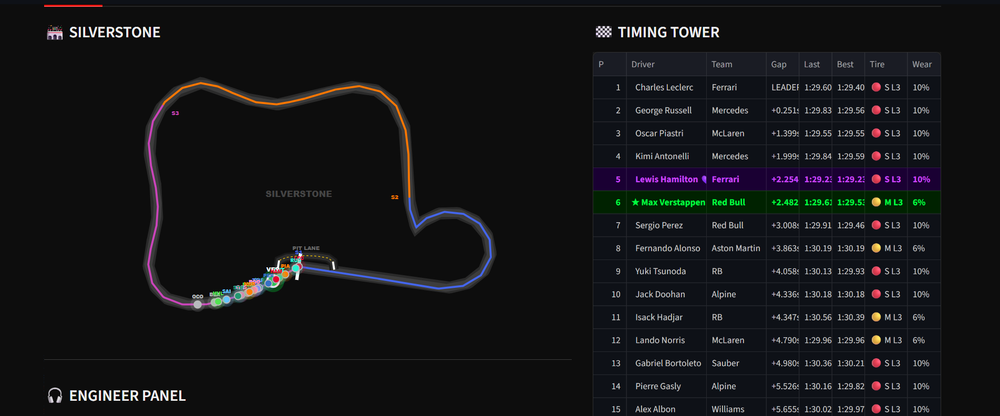

### Engineer Panel
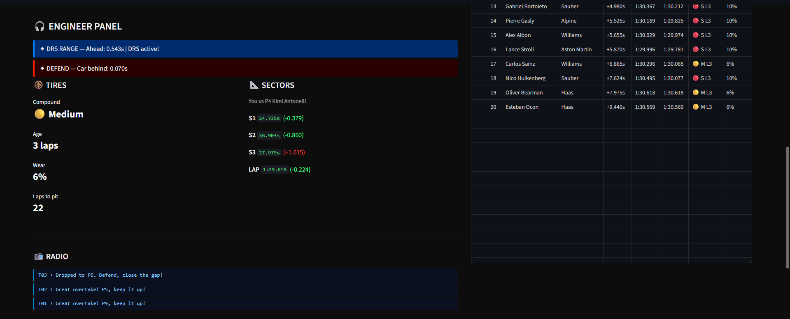

### Analysis Tab
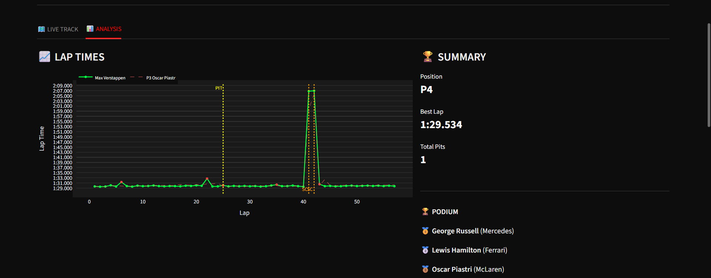
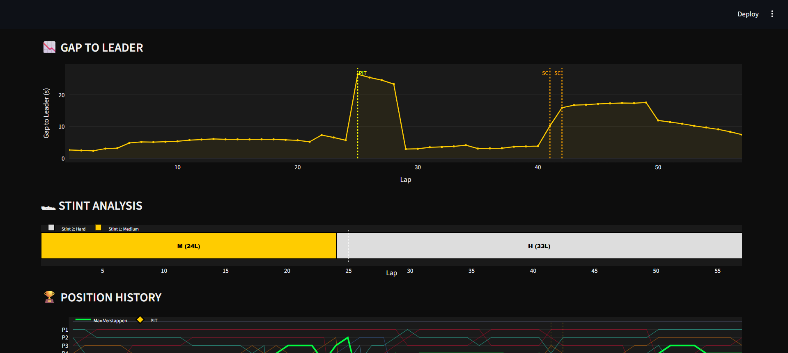

### Race End
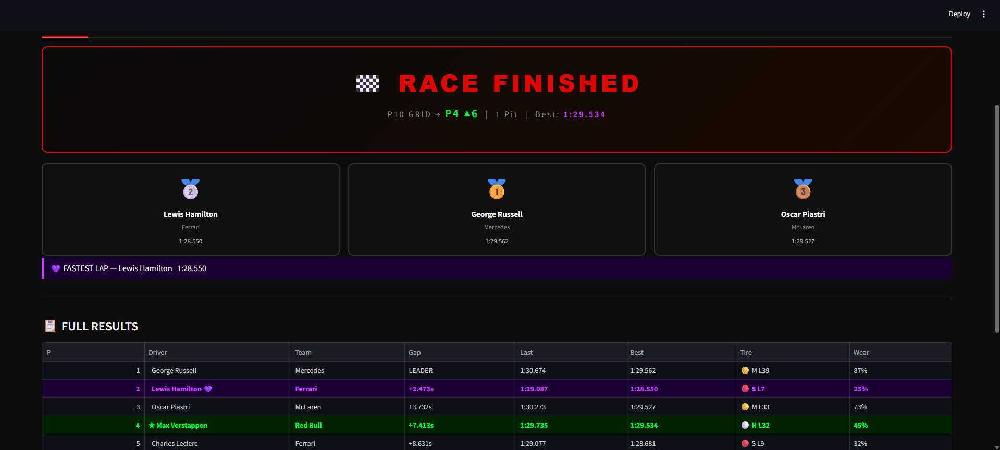

## Features

- **20 real 2025 F1 drivers** across all 10 teams with accurate pace differentials
- **Live animated track map** — all 20 cars move in real time with pit lane visualization
- **Timing Tower** — live gaps, tire compound, wear %, best/last lap times
- **Engineer Panel** — sector times, DRS indicator, tire wear alerts, driver radio messages
- **Race strategy** — choose between Aggressive / Balanced / Conservative tire strategies
- **Push modes** — Protect / Normal / Push affects pace, tire degradation and mistake probability
- **Safety Car** — random incidents trigger SC periods
- **Fastest Lap** — dynamic FL tracking with fuel load effect (changes hands during the race)
- **Analysis Tab** — position history chart, gap to leader, stint visualization, lap time chart
- **Race End Summary** — podium cards, full results, fastest lap banner

## How to Run

**1. Clone the repository**
```bash
git clone https://github.com/OzgurAltinisik/f1-race-engineer.git
cd f1-race-engineer
```

**2. Install dependencies**
```bash
pip install -r requirements.txt
```

**3. Run the app**
```bash
streamlit run app.py
```

The app will open at `http://localhost:8501` in your browser.

## Project Structure

```
f1_engineer/
├── app.py          # Streamlit UI, session state, live race loop
├── simulation.py   # Race engine: drivers, tires, lap simulation, strategy
├── track.py        # Track map rendering, visual positions, telemetry
└── requirements.txt
```

## How It Works

- `simulation.py` runs the physics: each lap, every driver calculates a lap time based on their base pace, tire compound/age, push level, and random noise. A fuel load effect (0.013s/lap) makes late-race laps on fresh tires genuinely faster than early laps.
- `track.py` converts cumulative time gaps into track positions (0–1 progress) and renders the Plotly circuit figure.
- `app.py` drives a Streamlit rerun loop every 0.25s, advancing the visual clock and triggering lap simulations when a full lap duration elapses.

## Notes

- **Desktop only** — mobile layout is not optimized in this version.
- Simulation speed can be set to 1x / 2x / 5x / 10x in the race controls.
- Random seed is not fixed — every race plays out differently.

## Tech Stack

- [Streamlit](https://streamlit.io/) — UI framework
- [Plotly](https://plotly.com/python/) — interactive charts and track map
- [Pandas](https://pandas.pydata.org/) — timing tower data
- Pure Python dataclasses for simulation logic

## License

MIT
